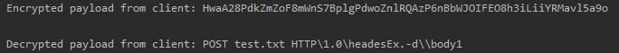
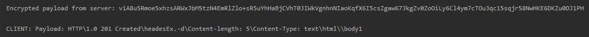

  
# Table of contents
  
  * [Task Description](#task-description)
  * [File List](#file-list)
  * [Implementation](#implementation)
  * [How to use](#how-to-use)
  
# Task Description
In this project we should implement a protocol stack, namely a transport protocol based on UDP, a session-level security protocol inspired by SSL/TLS, and an application-level protocol.
You must present this project as a client and a server, both using a library that contains the protocol logic.
The library must be made up of 3 modules, for each level of the protocol stack, with a well-defined API and that adheres to the layered architecture.
For transport and session level protocols the BSD Sockets API is a recommended source of inspiration, while for the application-level protocol something that resembles an HTTP client API is a recommended source of inspiration.

# File List
- HttpServerApplication.java
- UDPClient.java
- UDPServer.java
- Packet.java
- AES.java


# Implementation 

I have the following features implemented in my project :
* Client
* Server instantiated in HttpServerApplication class
* Simulation routing of network packets
* Encryption algorithm using AES – Advanced Encryption Standard

-------------------------

I have tried to implement program that enables reliable data transfer between  server and  client over the UDP protocol using DatagramChannel.
Also I have tried to simulate application-level protocol something that resembles an HTTP client API using "GET" and "POST" requests.
This HTTP client API is based on file manager maintained between client ans server.

---------------------

**Server**

My server is being initialized in the HttpServerApplication.java class where we can set a port number and any directory for the file management.
So after we run the program, it reads user input, where we can figure out the port number Ex.(-p 8080) or out file directory path Ex.(-d \Users\janegarciu\Documents\NP\UDP-Client-Server-Application)
After server had been launched, listener( ) method listens to client requests on connection.

The main logic is included in the UDPServer.java class.
The java.nio.channels.DatagramChannel class does not have any public constructors. 
Instead, I have created a new DatagramChannel object using the static open( ) method.
This channel is not initially bounded to any port:
```
 public void listenAndServe( int port, String directory) throws IOException {
        try (DatagramChannel channel = DatagramChannel.open()) {
            channel.bind(new InetSocketAddress(port));

            System.out.println("" + channel.getLocalAddress());

            ByteBuffer buf = ByteBuffer
                    .allocate(Packet.MAX_LEN)
                    .order(ByteOrder.BIG_ENDIAN);


```
We start listening every client request. 
Also I have used ByteBuffer for my all data.
The receive( ) method writes one datagram packet from the channel into a ByteBuffer.
```
                 buf.clear();
                SocketAddress router = channel.receive(buf);

                // Parse a packet from the received raw data.
                buf.flip();
                Packet packet = Packet.fromBuffer(buf);
                buf.flip();
```
 In order to parse received data I implemented fromBuffer( ) method, which creates a packet from the data in given ByteBuffer to BigEndian.
 So any client message is being handled and encrypted.
 
 Therefore, the main idea of my project is to show Http client api working together with UDP Server, I have performed methods which analyse http requests and implement file managing:
 * POST file with text 
 * GET file with text
 * UPDATE existed file with text(Same POST, but updating existing file)
 
 
 **HTTP parser**
 
 It has a very simple logic in order to simulate basic operations of HTTP API requests.
 
 Client sends request
 
 (example of a string "post -h headesEx. -d body1 test.txt")  which is converted into -->  (POST test.txt HTTP\1.0\headesEx.-d\\body1) 
 
 and server sends response in the following form(using postResponse( ) and getResponse( ) methods):
 
 (HTTP\1.0 201 Created\headesEx.-d\Content-length: 5\Content-Type: text\html\\body1)
 
```
                    method = splitClientPayload[0];
                    url = splitClientPayload[1];
                    requestHeader = splitClientPayload2[2];

                    if (method.equals("get") || method.equals("GET")) {
                        if (url.equals("/") & url.length() == 1) {
                            getFileResponse(directory);
                        } else {
                            getResponse(directory, url);
                        }
                    } else {
                        if (splitClientPayload2.length > 3) {
                            requestEntityBody = splitClientPayload2[4];
                        }
                        postResponse(directory, url, requestEntityBody);
                    }

                    serverResponse = responseVersion + " " + statusCode + " " + phrase + "\\" + responseHeader + "\\" + "\\" + responseEntityBody;

                    System.out.println("SERVER: Sending this message to client: " + serverResponse);
```
Also there are implemented methods for "3 way handshake" in order to make UDP connection more reliable and guarantee packet transmission

--------------------
**Client**

*Get request*

It accepts client request as a parameter. Written request is split by spaces and analyzed on header presence. 

In order to send this payload to server and establish the connection, three-way handshake operation is performed:
SYN message is sent to the server side from the client throught eh open channel.
Server is set to non-blocking mode to receive SYN message during the specified timeout on the client side.
If there is no response within timeout "No response after timeout" - is printed.

Server code:
```
                    // CONNECTION REQUEST
                if (packet.getType() == 1) {
                    System.out.println("SERVER: Sending back syn ack");
                    Packet resp = packet.toBuilder()
                            .setType(2)
                            .create();
                    channel.send(resp.toBuffer(), router);
                }
```
Client code:
```
                                  String msg = "SYN";            // Creating packet
                                  Packet p = new Packet.Builder()
                                          .setType(1)
                                          .setSequenceNumber(sequenceNumber)
                                          .setPortNumber(serverAddress.getPort())
                                          .setPeerAddress(serverAddress.getAddress())
                                          .setPayload(msg.getBytes())
                                          .create();
                                  channel.send(p.toBuffer(), routerAddr);
                                  System.out.println("CLIENT: Sending SYN request to the router address: " + routerAddr);
```
Otherwise, we receive a packet sent from the server with SYN-ACK message. After that we are sending and ACK message to the server, which means that we have established connection with the server.

**Also, what is important, we check whether sequence number remained the same.**

Only if it remained the same, we finish three-way handshake.
Now we can send our payload to the server. Packet is constructed and sent to the server and client is waiting for the response 
which should be received within timeout set using the selector select() function:
```
                // Try to receive a packet within timeout.
                channel.configureBlocking(false);
                Selector selector = Selector.open();
                channel.register(selector, OP_READ);
                System.out.println("Waiting for the response... ");
                selector.select(15000);
```
If payload is received, it is decrypted using the same secret key and is printed in the client's terminal window.

After all these actions done, connection, 
connection between client through sending FIN message to the server and receiving FIN ACK message back.
Otherwise, connection can be identified as terminated.

```
// CLOSING REQUEST
                if (packet.getType() == 3) {
                    System.out.println("SERVER: Sending back FYN-ACK");
                    Packet resp = packet.toBuilder()
                            .setType(4)
                            .create();
                    channel.send(resp.toBuffer(), router);
```

--------------------

*Post request*

Simmilar to the GET request logic is in here. Request is split by spaces and analyzed on header and directory presence. We need to specify directory in order to create a file in which later we will be able to post data that we are sending.
After that http request payload is constructed. Three-way handshake described above is done. Now we can send our payload to the server. For this we encrypt our data with secret encryption key, in my case secret key is "Burlacu". Packet is constructed and sent to the server and client is waiting for the response 
which should be received within timeout set using the selector select() function. If payload is received, it is decrypted using the same secret key and is printed in the client's terminal window. After all these actions done, connection, 
connection between client through sending FIN message to the server and receiving FIN ACK message back. Otherwise, connection can be identified as terminated.

**Packets**
 
 So this part was very interesting.
 Each packet has their own properties:
 ```
    private final int type;
    private final long sequenceNumber;
    private final InetAddress peerAddress;
    private final int peerPort;
    private final byte[] payload;
```
Which helped me to distinguish each other. It comes useful when I sent response of some packet, and it should has the same port and address like the previous one.

Moreover, because the original BSD socket API includes the concept of "network byte order", which is big-endian. 
I have wrote methods which Create a byte buffer in BigEndian for the packet.

```
   public ByteBuffer toBuffer() {
        ByteBuffer buf = ByteBuffer.allocate(MAX_LEN).order(ByteOrder.BIG_ENDIAN);
        write(buf);
        buf.flip();
        return buf;
    }
```

Also all the packets with different packet types are directly followed by the payload data.
After execution of a specific method each packet obtains "packet type":
```
 Packet p = new Packet.Builder()
                        .setType(0) //sending get request
                        .setSequenceNumber(1L)
                        .setPortNumber(serverAddress.getPort())
                        .setPeerAddress(serverAddress.getAddress())
                        .setPayload(message.getBytes())
                        .create();
                channel.send(p.toBuffer(), routerAddr);

   Packet p = new Packet.Builder()
                        .setType(3) //closing connection
                        .setSequenceNumber(sequenceNumber)
                        .setPortNumber(serverAddress.getPort())
                        .setPeerAddress(serverAddress.getAddress())
                        .setPayload(msg.getBytes())
                        .create();
```
Obviously sequenceNumber++; of each packet increases.
 
--------------------
**Encryption algorithm**

In order to encrypt the data encapsulated in packets I have used AES(Advanced Encryption Standard).
AES is block cipher capable of handling 128 bit blocks, using keys sized at 128, 192, and 256 bits. Each cipher encrypts and decrypts data in blocks of 128 bits using cryptographic keys of 128-, 192- and 256-bits, respectively. 
It uses the same key for encrypting and decrypting, so the sender and the receiver must both know — and use — the same secret key.

All logic can be found in AES.java class.
I have used base64 encoding in UTF-8 charset.
Each message that is sent is encrypted and decrypted in this way using encrypt() and decrypt() methods:
```
                String message = AES.encrypt(clientPayload, "Burlacu"); //"Burlacu" is the secret key
                String decryptedPayload = AES.decrypt(payload, "Burlacu");
```

Example of encryption of the request on Server side:


Example of encryption of the request on Client side:



## How to use
- Run first main method located in HTTPServerApplication.java class. In console write your directory with files which you would like to manage "-d C:\\..." 
- Run second main method located in UDPClient.java class which will start a new client and in console write get/post  specifying -h headers and -d body of the request, examples can be found above.

## Author

* [**Garciu Eugenia**](https://github.com/janegarciu)
